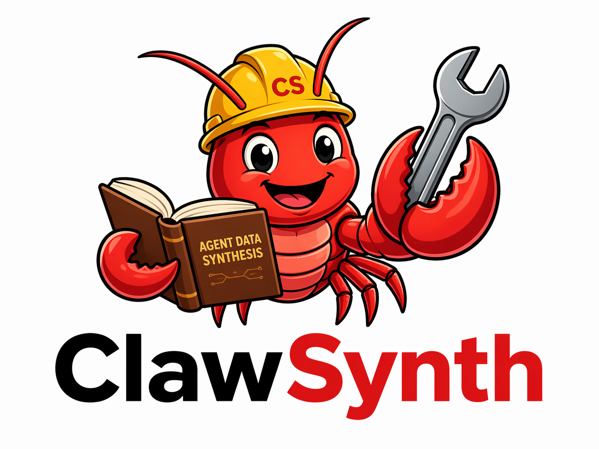

# ClawSynth

<p align="center">
  
</p>


ClawSynth 是一个面向 OpenClaw Agent 的数据合成项目，用来批量构造可执行的用户 query、为需要本地输入文件的 query 反向合成文件，并最终调用 OpenClaw 生成完整对话轨迹。

当前项目主要包含三个阶段：

- `合成 query`：根据 skill 组合生成自然语言 query，并做人设改写。
- `反向生成文件`：分析 query 是否需要本地输入文件，并用 OpenClaw 反向生成这些文件。
- `正向轨迹生成`：把准备好的 query、skills 和输入文件交给 OpenClaw，生成最终对话轨迹。

此外，项目还提供一个独立的 `soft_verify` 验证模块，用来对 OpenClaw 生成出的对话轨迹做后处理验证。它会结合 query、workspace 状态和 agent 最终回复，生成验证计划并输出 `pass` / `review` / `fail` 结果。详细说明见 [src/soft_verify/README.md](/mnt/d/project/clawsynth/src/soft_verify/README.md)。

推荐整体流程是：

```text
skills
  -> gen_query 生成 queries_persona.jsonl
  -> batch_filegen 反向补齐输入文件
  -> batch_openclaw 生成最终轨迹
```

## 环境配置

本项目使用 Python `3.13.x`，推荐使用 `uv` 管理环境。

如果本机还没有 uv，可以先安装 uv，具体安装方式参考 uv 官方文档。安装好后，在项目根目录执行：

```bash
uv python install 3.13.5
uv sync --frozen
```

然后从示例环境变量文件创建本地 `.env`：

```bash
cp .env.example .env
```

`.env` 中需要配置三类模型：

```bash
# OpenClaw 正向轨迹生成模型
OPENCLAW_MODEL=litellm/glm-5-turbo

# OpenClaw 反向生成输入文件模型
GEN_OPENCLAW_MODEL=ali-qwen/qwen3.6-plus

# 反向文件生成前的预筛选模型
FILTER_MODEL=qwen3.6-plus
FILTER_API_BASE=https://dashscope.aliyuncs.com/compatible-mode/v1
FILTER_API_KEY=your_api_key_here

# query 生成模型
GEN_QUERY_MODEL=glm-5.1
GEN_QUERY_API_BASE=https://dashscope.aliyuncs.com/compatible-mode/v1
GEN_QUERY_API_KEY=your_api_key_here

# soft_verify 验证模型
VERIFY_API_KEY=your_api_key_here
VERIFY_MODEL=glm-5
# VERIFY_API_BASE=https://open.bigmodel.cn/api/paas/v4
VERIFY_TIMEOUT_SECONDS=120
VERIFY_SOFT_AGENT_MAX_ROUNDS=20

# soft_verify OCR 能力
PADDLEOCR_AISTUDIO_ACCESS_TOKEN=your_paddleocr_aistudio_access_token
```

另外需要确保 OpenClaw CLI 已经可用，并能看到可调用模型：

```bash
openclaw models list
```

如果模型名和你的 OpenClaw 配置不一致，请以 `openclaw models list` 的输出为准修改 `.env`。

## 前期准备

项目中有两类 skill 资源需要先解压。

### 解压文件生成 skill

`generator_skills/` 中的 zip 用于反向合成 query 所需的本地输入文件：

```bash
cd generator_skills
unzip claw-input-file-generator.zip
cd ..
```

解压后应能看到：

```text
generator_skills/
  claw-input-file-generator/
    SKILL.md
    ...
```

### 解压普通 skills

`skills/` 中的 zip 是 query 生成和 OpenClaw 执行阶段会用到的普通能力：

```bash
cd skills
unzip excel-xlsx-1.0.2.zip
unzip multi-search-engine-2.1.3.zip
unzip ocr-local-1.0.0.zip
unzip polymarket-trade-1.0.6.zip
unzip weather-1.0.0.zip
cd ..
```

解压后每个 skill 目录下都应包含 `SKILL.md`。

如果这些目录已经存在，可以不用重复解压。

**您可以添加更多可用的skills来进行采样，这样可以丰富数据的类型。**

## 目录和文件作用

```text
.
├── README.md
├── .env.example
├── pyproject.toml
├── uv.lock
├── skills/
├── generator_skills/
├── src/
│   ├── README.md
│   ├── batch_filegen.py
│   ├── batch_openclaw.py
│   └── gen_query/
│       ├── README.md
│       ├── config.py
│       ├── run_step0_to_step3.sh
│       ├── step0_generate_random_workspaces.py
│       ├── step1_generate_queries.py
│       ├── step2_run_benchmark.py
│       └── step3_persona_rewrite.py
└── result/
```

主要文件说明：

- `src/gen_query/README.md`：query 合成阶段的详细说明。
- `src/README.md`：反向文件生成和正向轨迹生成两个 OpenClaw 阶段的详细说明。
- `src/soft_verify/README.md`：对话轨迹验证模块的详细说明，包括 LiteLLM 日志整理、验证输入抽取和两步验证流程。
- `src/gen_query/config.py`：query 合成阶段的主要配置入口，包括 workspace 数量、skill 采样数、随机种子等。
- `src/gen_query/run_step0_to_step3.sh`：一键执行 query 合成的 step0 到 step3。
- `src/batch_filegen.py`：反向生成本地输入文件。
- `src/batch_openclaw.py`：正向生成 OpenClaw 对话轨迹。
- `skills/`：普通 skill 池，用于 query 生成和 OpenClaw 执行。
- `generator_skills/`：文件合成专用 skill。
- `result/`：建议用于存放每次实验的 workspace、filegen 结果和 openclaw 轨迹结果。

## 快速启动

下面给出一个从 query 合成到最终轨迹生成的推荐流程。路径可以按自己的实验名称调整，建议尽量使用绝对路径。

### 1. 生成 query

先检查 `src/gen_query/config.py` 中的采样参数，例如：

- `WORKSPACES_TO_BUILD`
- `MIN_SKILLS_PER_WORKSPACE`
- `MAX_SKILLS_PER_WORKSPACE`
- `QUERIES_PER_SKILL`
- `BENCH_CONCURRENCY`
- `REWRITE_WORKERS`

然后运行：

```bash
uv run bash src/gen_query/run_step0_to_step3.sh \
  --skill-hub ./skills \
  --workspace-hub ./result/syn_data_test_v2/workspace_test
```

执行完成后，每个 workspace 下会生成：

```text
tmp_benchmark_queries.jsonl
queries.jsonl
queries_persona.jsonl
```

其中 `queries_persona.jsonl` 是后续阶段使用的 query 输入文件。

### 2. 反向生成输入文件

有些 query 会要求处理本地图片、音频、文档、表格等输入文件。这个阶段会先筛选哪些 query 需要文件，再用 OpenClaw 合成这些文件。

```bash
PYTHONUNBUFFERED=1 nohup uv run python src/batch_filegen.py run \
  --workspace-hub ./result/syn_data_test_v2/workspace_test \
  --workspace-base ./result/syn_data_test_v2/filegen_workspace \
  --results-dir ./result/syn_data_test_v2/filegen_result \
  --skills-source ./generator_skills \
  --max-domain-parallel 5 \
  > ./result/syn_data_test_v2/filegen_run.log 2>&1 &
```

这个阶段需要 `.env` 中配置：

- `GEN_OPENCLAW_MODEL`
- `FILTER_MODEL`
- `FILTER_API_BASE`
- `FILTER_API_KEY`

完成后，建议把下一阶段的 `--workspace-hub` 指向这里的 `--workspace-base`，因为输入文件会生成到 filegen 的临时 workspace 中。

### 3. 正向生成 OpenClaw 轨迹

将 query、skills 和反向生成的输入文件交给 OpenClaw，生成最终对话轨迹：

```bash
PYTHONUNBUFFERED=1 nohup uv run python src/batch_openclaw.py run \
  --workspace-hub ./result/syn_data_test_v2/filegen_workspace \
  --workspace-base ./result/syn_data_test_v2/openclaw_workspace \
  --results-dir ./result/syn_data_test_v2/openclaw_result \
  --skills-pool ./skills \
  --max-domain-parallel 5 \
  > ./result/syn_data_test_v2/openclaw_run.log 2>&1 &
```

这个阶段需要 `.env` 中配置：

- `OPENCLAW_MODEL`

如果你希望获取到底层模型最原始的请求和返回结果，而不只是最终 session 轨迹文件，那么必须启用 `litellm_config/`，让 OpenClaw 通过 LiteLLM 网关调用模型。否则默认流程只能拿到 OpenClaw 导出的 session 轨迹，拿不到最底层的原始请求数据。详细说明见 [litellm_config/README.md](./litellm_config/README.md)。

启用 LiteLLM 后，原始抓取结果会写入 `litellm_config/success_events_all.jsonl`。这个文件信息更完整，但不太适合直接阅读；如果你想把它转换成更易读的对话格式，可以执行：

```bash
uv run python src/process_data/process_conversations.py \
  --input_file ./litellm_config/success_events_all.jsonl \
  --output_file ./litellm_config/message.jsonl
```

处理后的 `litellm_config/message.jsonl` 更适合直接查看、抽样检查，或者继续做后续数据处理。

输出结果会保存在 `--results-dir` 中，包括：

- `checkpoint.jsonl`
- `summary.json`
- 每个 workspace/domain 下的 OpenClaw session 轨迹文件

## 常用管理命令

查看反向文件生成进度：

```bash
uv run python src/batch_filegen.py status \
  --workspace-hub ./result/syn_data_test_v2/workspace_test
```

清理反向文件生成残留 agents：

```bash
uv run python src/batch_filegen.py cleanup \
  --workspace-hub ./result/syn_data_test_v2/workspace_test
```

查看正向轨迹生成进度：

```bash
uv run python src/batch_openclaw.py status \
  --workspace-hub ./result/syn_data_test_v2/filegen_workspace \
  --workspace-base ./result/syn_data_test_v2/openclaw_workspace \
  --results-dir ./result/syn_data_test_v2/openclaw_result
```

清理正向轨迹生成残留 agents：

```bash
uv run python src/batch_openclaw.py cleanup \
  --workspace-hub ./result/syn_data_test_v2/filegen_workspace \
  --workspace-base ./result/syn_data_test_v2/openclaw_workspace \
  --results-dir ./result/syn_data_test_v2/openclaw_result
```

## 更多说明

更详细的阶段说明请看：

- [src/gen_query/README.md](./src/gen_query/README.md)
- [src/README.md](./src/README.md)

如果要重新跑某个阶段，建议先确认对应阶段的输出目录、日志文件和 checkpoint 行为，避免把不同实验的数据混在一起。
